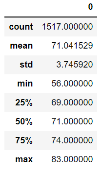

# surfs_up
Weather analysis for a surfing shop

## Overview of the Project Challenge
In an attempt to open up a surfing shop in Hawaii, I've partnered up with W. Avy on an opportunity to do business. While W. Avy likes the idea, he needed some weather data to make a final decision. W. Avy has requested a summary statistics for the month of June and December. Using the filter & extract function is the key to this challenge.

## Results
For the month of June and December, there were 1700 and 1517 weather data points recorded, respectively. Both months are fairly warm and ideal for surfing and ice cream. Below is a side by side table comparision of the two months. 

| June | December |
| :---: | :---: |
|   |   |

## Summary 
Based on the statistical summary of the temperature, June and December are great months for surfing and eating ice cream. Diving deeper, the minimum temperature in June, 64 degrees, is still suitable for surf and cone. The minimum temperature in December on the other hand, 56 degrees, may be getting people thinking about long sleeves more than ice cream. Overall, these two months still prove to have ideal temperture for surfing and eating ice cream. 

#### Considerations and Recommendations
To explore the data in more details, here are a couple of recommendations to create and bring to W. Avy's attention
1) A frequency analysis for every month of the year with smaller bins to identify possible low/high dates of sales
2) Monthly statistical summary based on stations

Additionally, looking at other weather data, such as wind speed, humidity, and cloudiness, may also provide insight on people's decision to surf and/or eat ice cream.
